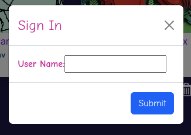

# StoryEchoes - Echo your imagination, one story at a time.

## Description

Create personalized storybooks effortlessly! Combine images, doodles, voice-to-text recordings, media and narration to craft engaging books. Kids can read, listen to narrations, or revisit their favorites using bookmarks. Edit and enhance your creations anytime!

## Tech stack

Built with React JS, CSS & HTML.

## Design

The website is designed keeping the main elements in focus, so it's easier to understand the user interface.

## Features

- **Responsive Design**: The website is fully responsive, providing all features across all devices and screen sizes. 
   
- **Create Books**: Add doodle, images, media, voice-to-text, and custom layouts.
- **Interactive Reading**: Read independently or play synced narration.
- **Edit & Bookmark**: Modify books anytime and bookmark for easy access w.r.t user.
- **Kids-Friendly**: Simple design with fun prompts for creativity.

## How to run the project

- Click on the link to load the page in the browser. 
_(https://storyechoes.netlify.app/)_

- The backend for this project is deployed on Vercel with below domain. 
_(https://story-echoes-backend.vercel.app)_

- The environment is setup with below variable to access the backend. 
VITE_API_URL="https://story-echoes-backend.vercel.app"

## How to Navigate through the website

- Landing Page: On loading the site, the user lands on the home page. 
   
   It is built of below sections 
  - Navbar: This is fixed website header & does not change during the navigation. 
    This holds the website Logo with name and menus 'Wonder Shelf', 'My Story Picks' and 'Who We Are' .
    On clicking the Logo the user can navigate to the Home page.
  - Main-Content: This section on initial load displays the slogan. On clicking this section the user can navigate to the 'Wonder Shelf'.
  - Footer: This is fixed website footer & does not change during the navigation. This holds the gitHub Logo along with gitHub repository of the project.

- Wonder Shelf: On selecting this menu, the Main-content area is loaded with Book List from the library.  
   
  User can perform below actions here. 
   
  - Search : Type in the search field to search the book title.
  - Sort : Sort the books on title.
  - List/Grid : List the books in List or Grid view. The list view is shown as below, 
   
  - Bookmark : Bookmark the book which are then listed in 'My Story Picks' with respect to the user. If the user is not logged in then Login is prompted. 
   
  - Edit : On clicking edit button, user will be navigated to the Edit Story Page, where he can edit the Story.
      \*\*Somebooks Site books are marked static, which cannot be edit. Button will be disabled.
  - Delete : Delete the book.
      \*\*Somebooks Site books are marked static, which cannot be deleted. Button will be disabled.
  - Add / Edit Story: On clicking add button, user will be navigated to the Add Story Page, where he can add a Story. 
   
  User can add story with below feautes 
    * Doodle: User can doodle a cover page. 
   
    * Speech to Text: User narrate the story to be written. 
   
    * AI Image: User can generate the AI image from the story content. 
   

  - Read Story: On clicking the book, user will be navigated to the Read Story Page, where he can read the book. He can flip the pages using the navigation buttons or clicking on the pages. The user can choose to read or play story for narration. Media buttons can also be played for background scores. 
   

- My Story Picks: On selecting this menu, the Main-content area is loaded with Book List marked as favourite using the Like button. This Book List also provides the read count of the respective book. 
   

- Who We Are: This page provides details about the website designers.

## How to setup the project

- Git clone the below project 
https://github.com/priya337/StoryEchoes.git

- run "npm i" to install the packages

- run "npm run dev"

# APIs
The mock API on Vercel is powered by json-server and uses the db.json file to simulate a backend. Below are the API details:

1. Get All Stories 
**Endpoint**: {DOMAIN}/stories 
**Method**: GET 
**Response JSON**: 
[
  {
    "id": "1",
    "title": "Nibbles and the Perfect Hat",
    "imageforstorytile": "./src/assets/Story1images/imageforstorytile.jpg",
    "description": "Follow Nibbles the garden gnome as he embarks on an adventure to find the perfect hat fit."
  },
  ...
]

2. Get Single Story 
**Endpoint**: {DOMAIN}/stories/:id 
**Method**: GET 
**Response JSON**: 
{
  "id": "1",
  "title": "Nibbles and the Perfect Hat",
  "front_cover": "/path_to_image/front_cover.jpg",
  "back_cover": "/path_to_image/back_cover.jpg",
  "content": [
    {
      "page": 1,
      "text": "Nibbles the garden gnome loved his hat...",
      "image": "/path_to_image/Story1images/page1.jpg"
    },
    ...
  ]
}

3. Add a New Story. Here the id for the new books is assigned by the json server.  
**Endpoint**: {DOMAIN}/stories 
**Method**: POST 
**Request JSON**: 
{
  "id": "3",
  "title": "A New Adventure",
  "description": "An amazing new story for young readers.",
  "front_cover": "/path_to_image/front_cover.jpg",
  "back_cover": "/path_to_image/back_cover.jpg",
  "content": [
    {
      "page": 1,
      "text": "This is the first page of the new adventure.",
      "image": "/path_to_image/page1.jpg"
    },
    {
      "page": 2,
      "text": "This is the second page of the new adventure.",
      "image": "/path_to_image/page2.jpg"
    }
  ]
} 
**Response JSON**: 
{
  "id": "3",
  "title": "A New Adventure",
  "description": "An amazing new story for young readers.",
  "front_cover": "/path_to_image/front_cover.jpg",
  "back_cover": "/path_to_image/back_cover.jpg",
  "content": [
    {
      "page": 1,
      "text": "This is the first page of the new adventure.",
      "image": "/path_to_image/page1.jpg"
    },
    {
      "page": 2,
      "text": "This is the second page of the new adventure.",
      "image": "/path_to_image/page2.jpg"
    }
  ]
}

4. Get All Users 
**Endpoint**: {DOMAIN}/users 
**Method**: GET 
**Response JSON**: 
[
  {
    "id": 1,
    "user": "polly",
    "bookIds": [
        "fd2a",
        "d807",
        "fd2e",
        "fd2b"
      ]
  },
  ...
]

# Components

1. Home.jsx 
Start page of the application.

2. Navbar.jsx 
Used for displaying header of each page with Logo & Menus.

3. Footer.jsx 
Used for displaying footer at the bottom of each page.

4. Whoweare.jsx 
Website and developers information.

5. WonderShelf.jsx 
Fetches all story data using the GET /stories API.

6. FunctionBar.jsx 
Provides search, sort & view features for story lists.

7. SignIn.jsx & SignInModal.jsx 
Used for signing user modal window.

8. ReadStory.jsx 
Fetches individual story data using the GET /stories/:id API.

9. AddStory.jsx  
Posts below  
  - The new story data using the POST /stories
  - The new media & pictures on cloudinary using the POST

10. EditStory.jsx 
Puts the updated individual story data using the PUT /stories/:id API.

11. Doodle.jsx 
Used for opening modal window for Doodling.

12. Speechtotext.jsx 
Used for speech to text modal window.

13. PollinationImage.jsx 
Used for AI image generations using the story text.

14. PageNotFound.jsx 
Used as fallback page on site navigation.

